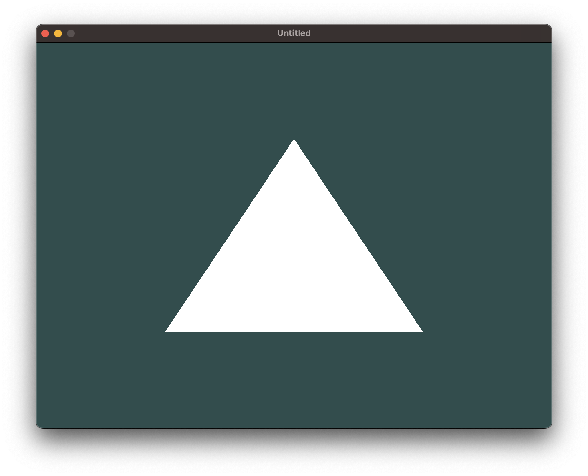

# OpenGL: Hello Triangle

  

# Description

A basic example of rendering a triangle using C++ and OpenGL.

The app creates a window using the [GLFW][glfw] library, loads OpenGL function pointers using the [GLAD][glad] library, and renders a triangle using a simple GLSL shader and shader class.

# Prerequisites&nbsp;:vertical_traffic_light:

- [Git][git]
- [CMake][cmake]
- C++ compiler
    - Windows: [MSVC][msvc] (Bundled with [Visual Studio][msvs])
    - MacOS: [Clang][clang] (Bundled with [Xcode][xcode])
    - Linux: [GCC][gcc]

# Getting started&nbsp;:runner:

### Getting the code&nbsp;:octocat:

- Clone the repository: `git clone https://github.com/taardal/opengl-triangle`

### Running the app&nbsp;:rocket:

- Generate project files: `cmake -S . -B build`
- Build executable from generated files: `cmake --build build`
- Run the executable: `./build/opengltriangle`

# Resources&nbsp;:books:

### Tools

- [CMake][cmake] (Build tool)

### Dependencies

- [GLFW][glfw] (Window management)
- [GLAD][glad] (OpenGL initialization)

### Knowledge

- [The Cherno: OpenGL][thecherno:opengl] (YouTube)
- [The Cherno: C++][thecherno:cpp] (YouTube)
- [OpenGL Tutorial][opengltutorial] (Website)
- [Learn OpenGL][learnopengl] (Website)

[clang]: http://clang.org/
[cmake]: https://cmake.org/
[gcc]: https://gcc.gnu.org/
[git]: https://git-scm.com
[glad]: https://github.com/Dav1dde/glad
[glfw]: https://www.glfw.org/
[learnopengl]: https://learnopengl.com/
[msvc]: https://visualstudio.microsoft.com/vs/features/cplusplus/
[msvs]: https://visualstudio.microsoft.com/
[opengltutorial]: http://www.opengl-tutorial.org/
[thecherno:opengl]: https://www.youtube.com/watch?v=W3gAzLwfIP0&list=PLlrATfBNZ98foTJPJ_Ev03o2oq3-GGOS2&ab_channel=TheCherno
[thecherno:cpp]: https://www.youtube.com/watch?v=18c3MTX0PK0&list=PLlrATfBNZ98dudnM48yfGUldqGD0S4FFb&ab_channel=TheCherno
[xcode]: https://developer.apple.com/xcode/